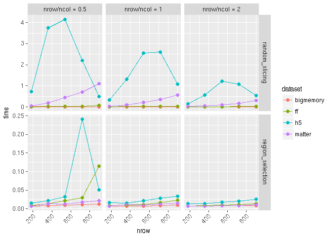
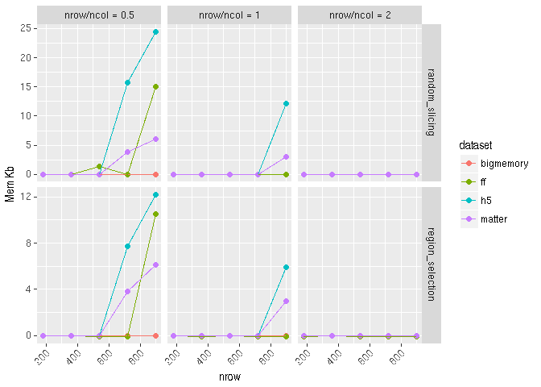
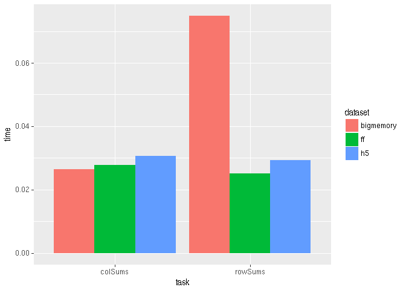

mbenchmark: benchmarking the common matrix operations
================

Introduction
------------

This is a generic framework for benchmarking the common matrix operations among different matrix file formats.

-   subsetting
    -   `region_selection`: continuous block selection
    -   `random_slicing`: non-continuous slab selection
-   traversing
    -   `rowSums`
    -   `colSums`

Takes a list of different `matrix` containers/objects as input
--------------------------------------------------------------

The only requirements for the `matrix` object are:

-   support `[` indexing method for subsetting
-   `dim` accessors to retrieve dimension information

``` r
library(HDF5Array)#must load it first to avoid namespace conflicting
library(mbenchmark)
mat <- matrix(seq_len(2e6), nrow = 1e3, ncol =2e3)
dims <- dim(mat)

#bigmemory
library(bigmemory)
bm.file <- tempfile()
suppressMessages(bm <- as.big.matrix(mat, backingfile = basename(bm.file), backingpath = dirname(bm.file)))
#wrap it into DelayedArray
library(DelayedArray)
bmseed <- BMArraySeed(bm)
bm <- DelayedArray(bmseed)

#h5
library(rhdf5)
h5.file <- tempfile()
h5createFile(h5.file)
h5createDataset(h5.file, "data", dims, storage.mode = "double", chunk=c(100,100), level=7)
h5write(mat, h5.file,"data")
#wrap it into DelayedArray
hm = HDF5Array(h5.file, "data")

library(ff)
ff.file <- tempfile()
fm <- ff(mat, vmode="double", dim=dims, filename = ff.file)
fm <- DelayedArray(fm)

library(matter)
mm <- matter_mat(mat)
mm <- DelayedArray(mm)
```

Compare disk usage
------------------

``` r
mat.list <- list(bigmemory = bm, ff = fm, h5 = hm, matter = mm)

utils:::format.object_size(file.size(bm.file), units = "Mb")
```

    ## [1] "7.6 Mb"

``` r
utils:::format.object_size(file.size(h5.file), units = "Mb")
```

    ## [1] "2.8 Mb"

``` r
utils:::format.object_size(file.size(ff.file), units = "Mb")
```

    ## [1] "15.3 Mb"

``` r
utils:::format.object_size(file.size(matter::paths(mm@seed)), units = "Mb")
```

    ## [1] "7.6 Mb"

Compare memory usage
--------------------

``` r
library(pryr)
lapply(mat.list, object_size)
```

    ## $bigmemory
    ## 2.55 kB
    ## 
    ## $ff
    ## 2.01 kB
    ## 
    ## $h5
    ## 1.95 kB
    ## 
    ## $matter
    ## 9.18 kB

Run `subsetting` benchmark
--------------------------

``` r
#ubound specify the upper bound of the size of the subset. It is the value of the maximum percentage of original matrix
res <- mbenchmark(mat.list, type = "subsetting", times = 3, ubound = 0.9, trace_mem = TRUE, verbose = FALSE) 
```

    ## random_slicing

    ## region_selection

Results are collected as a `data.table`, which is easy to query or facetting.

``` r
head(res)
```

    ##     time mem_change   dataset timeid nrow nrow/ncol           task
    ## 1: 0.036         24 bigmemory      1  180       0.5 random_slicing
    ## 2: 0.016         28        ff      1  180       0.5 random_slicing
    ## 3: 0.733          0        h5      1  180       0.5 random_slicing
    ## 4: 0.059         20    matter      1  180       0.5 random_slicing
    ## 5: 0.008          0 bigmemory      2  180       0.5 random_slicing
    ## 6: 0.011          0        ff      2  180       0.5 random_slicing

Resume the long-running task by `cached` results
------------------------------------------------

Some time things could go wrong before the entire benchmarking completes. To save the time, a cached file can be passed to the `mbenchmark` so that when this command is re-executed the sub-tasks previously saved in this file will be skipped.

``` r
cachefile <- tempfile()
res <- mbenchmark(mat.list, type = "subsetting", cache.file = cachefile) 
```

Quick plot
----------

``` r
autoplot(res)
```



``` r
plot_mem(res, units = "Kb")
```



Run `traversing` benchmark
--------------------------

``` r
mat.list <- list(bigmemory = bm, ff = fm, h5 = hm)
res <- mbenchmark(mat.list, type = "traversing")
```

    ## rowSums

    ## colSums

``` r
autoplot(res)
```



Todo
----

-   `clear_page_cache`
-   `parallel` IO
-   More matrix operations
