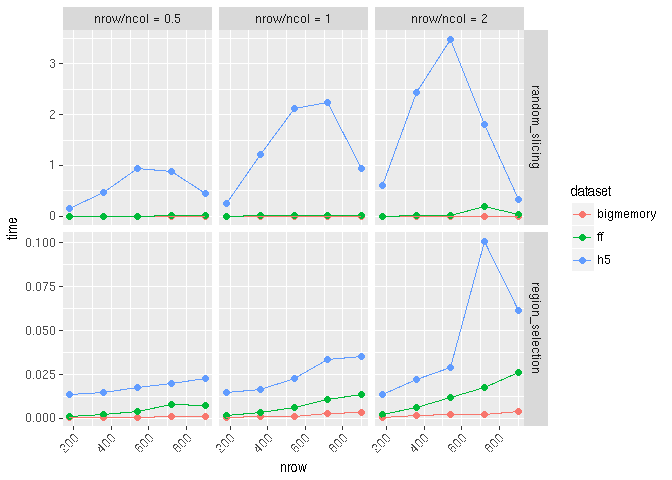

## Introduction

This is a generic framework for benchmarking the common matrix operations among different matrix file formats.

* subsetting
    * `region_selection`: continuous block selection
    * `random_slicing`: non-continuous slab selection
* traversing
    * `rowSums`
    * `colSums`

## Takes a list of different `matrix` containers/objects as input
The only requirements for the `matrix` object are:

* support `[` indexing method for subsetting
* `dim` accessors to retrieve dimension information


```r
library(HDF5Array)#must load it first to avoid namespace conflicting
library(mbenchmark)
mat <- matrix(seq_len(2e6), nrow = 1e3, ncol =2e3)
dims <- dim(mat)

#bigmemory
library(bigmemory)
bm.file <- tempfile()
suppressMessages(bm <- as.big.matrix(mat, backingfile = basename(bm.file), backingpath = dirname(bm.file)))
#wrap it into DelayedArray
library(DelayedArray)
bmseed <- BMArraySeed(bm)
bm <- DelayedArray(bmseed)

#h5
library(rhdf5)
h5.file <- tempfile()
h5createFile(h5.file)
h5createDataset(h5.file, "data", dims, storage.mode = "double", chunk=c(100,100), level=7)
h5write(mat, h5.file,"data")
#wrap it into DelayedArray
hm = HDF5Array(h5.file, "data")

library(ff)
ff.file <- tempfile()
fm <- ff(mat, vmode="double", dim=dims, filename = ff.file)
fm <- DelayedArray(fm)
```
## Compare disk usage

```r
mat.list <- list(bigmemory = bm, ff = fm, h5 = hm)

utils:::format.object_size(file.size(bm.file), units = "Mb")
```

```
## [1] "7.6 Mb"
```

```r
utils:::format.object_size(file.size(h5.file), units = "Mb")
```

```
## [1] "2.8 Mb"
```

```r
utils:::format.object_size(file.size(ff.file), units = "Mb")
```

```
## [1] "15.3 Mb"
```
## Compare memory usage

```r
library(pryr)
lapply(mat.list, object_size)
```

```
## $bigmemory
## 2.55 kB
## 
## $ff
## 2.01 kB
## 
## $h5
## 1.97 kB
```


## Run `subsetting` benchmark

```r
#ubound specify the upper bound of the size of the subset. It is the value of the maximum percentage of original matrix
res <- mbenchmark(mat.list, type = "subsetting", times = 3, ubound = 0.9, trace_mem = TRUE, verbose = FALSE) 
```

```
## random_slicing
```

```
## subset shape (nrow / ncol):0.5
```

```
## subset shape (nrow / ncol):1
```

```
## subset shape (nrow / ncol):2
```

```
## region_selection
```

```
## subset shape (nrow / ncol):0.5
```

```
## subset shape (nrow / ncol):1
```

```
## subset shape (nrow / ncol):2
```


Results are collected as a `data.table`, which is easy to query or facetting.

```r
head(res)
```

```
##     time mem_change   dataset timeid nrow nrow/ncol           task
## 1: 0.015          0 bigmemory      1  180       0.5 random_slicing
## 2: 0.009         -4        ff      1  180       0.5 random_slicing
## 3: 0.236          0        h5      1  180       0.5 random_slicing
## 4: 0.007          0 bigmemory      2  180       0.5 random_slicing
## 5: 0.008          0        ff      2  180       0.5 random_slicing
## 6: 0.146          0        h5      2  180       0.5 random_slicing
```

## Quick plot


```r
autoplot(res)
```

```
## Error in grid.Call(C_textBounds, as.graphicsAnnot(x$label), x$x, x$y, : X11 font -adobe-helvetica-%s-%s-*-*-%d-*-*-*-*-*-*-*, face 1 at size 9 could not be loaded
```




```r
plot_mem(res, units = "Kb")
```

```
## Error in grid.Call(C_textBounds, as.graphicsAnnot(x$label), x$x, x$y, : X11 font -adobe-helvetica-%s-%s-*-*-%d-*-*-*-*-*-*-*, face 1 at size 9 could not be loaded
```


## Run `traversing` benchmark

```r
mat.list <- list(bigmemory = bm, ff = fm, h5 = hm)
res <- mbenchmark(mat.list, type = "traversing")
```

## Todo
* `clear_page_cache`
* `parallel` IO
* More matrix operations
