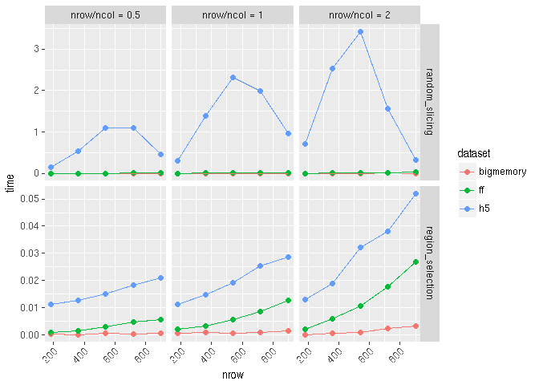

mbenchmark: benchmarking the common matrix operations
================

Introduction
------------

This is a generic framework for benchmarking the common matrix operations among different matrix file formats.

-   subsetting
    -   `region_selection`: continuous block selection
    -   `random_slicing`: non-continuous slab selection
-   traversing
    -   `rowSums`
    -   `colSums`

Takes a list of different `matrix` containers/objects as input
--------------------------------------------------------------

The only requirements for the `matrix` object are:

-   support `[` indexing method for subsetting
-   `dim` accessors to retrieve dimension information

``` r
library(mbenchmark)
mat <- matrix(seq_len(2e6), nrow = 1e3, ncol =2e3)
dims <- dim(mat)

#bigmemory
library(bigmemory)
bm.file <- tempfile()
suppressMessages(bm <- as.big.matrix(mat, backingfile = basename(bm.file), backingpath = dirname(bm.file)))
utils:::format.object_size(file.size(bm.file), units = "Mb")

#h5
library(rhdf5)
h5.file <- tempfile()
h5createFile(h5.file)
h5createDataset(h5.file, "data", dims, storage.mode = "double", chunk=c(100,100), level=7)
h5write(mat, h5.file,"data")
utils:::format.object_size(file.size(h5.file), units = "Mb")
hm = h5read(h5.file,"data")

library(ff)
ff.file <- tempfile()
fm <- ff(mat, vmode="double", dim=dims, filename = ff.file)
utils:::format.object_size(file.size(ff.file), units = "Mb")
```

Run `subsetting` benchmark
--------------------------

``` r
mat.list <- list(bigmemory = bm, ff = fm, h5 = hm)
#ubound specify the upper bound of the size of the subset. It is the value of the maximum percentage of original matrix
res <- mbenchmark(mat.list, type = "subsetting", times = 3, ubound = 0.9, verbose = FALSE) 
```

    ## random_slicing

    ## subset shape (nrow / ncol):0.5

    ## subset shape (nrow / ncol):1

    ## subset shape (nrow / ncol):2

    ## region_selection

    ## subset shape (nrow / ncol):0.5

    ## subset shape (nrow / ncol):1

    ## subset shape (nrow / ncol):2

Results are collected as a `data.table`, which is easy to query or facetting.

``` r
head(res)
```

    ##     time   dataset timeid nrow nrow/ncol           task
    ## 1: 0.001 bigmemory      1  180       0.5 random_slicing
    ## 2: 0.002        ff      1  180       0.5 random_slicing
    ## 3: 0.001        h5      1  180       0.5 random_slicing
    ## 4: 0.000 bigmemory      2  180       0.5 random_slicing
    ## 5: 0.002        ff      2  180       0.5 random_slicing
    ## 6: 0.000        h5      2  180       0.5 random_slicing

Quick plot
----------

``` r
autoplot(res)
```



Run `traversing` benchmark
--------------------------

``` r
mat.list <- list(bigmemory = bm, ff = fm, h5 = hm)
res <- mbenchmark(mat.list, type = "traversing")
```

Todo
----

-   `clear_page_cache`
-   `parallel` IO
-   More matrix operations
